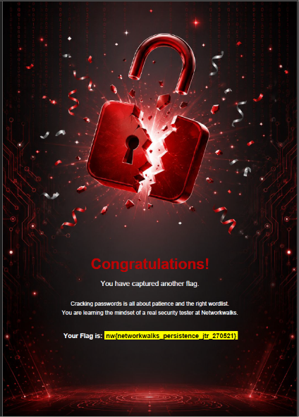
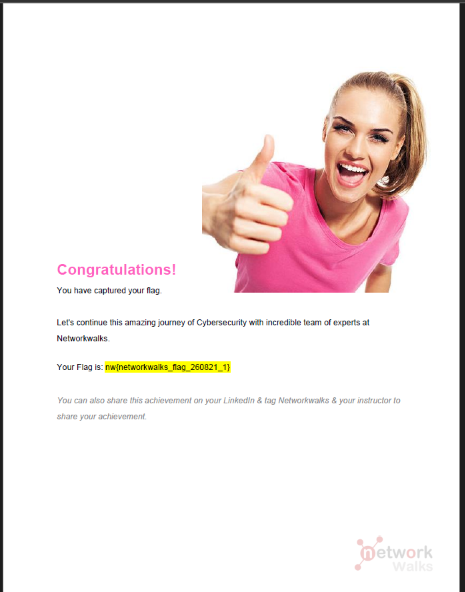
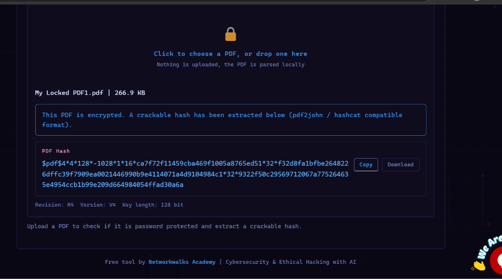
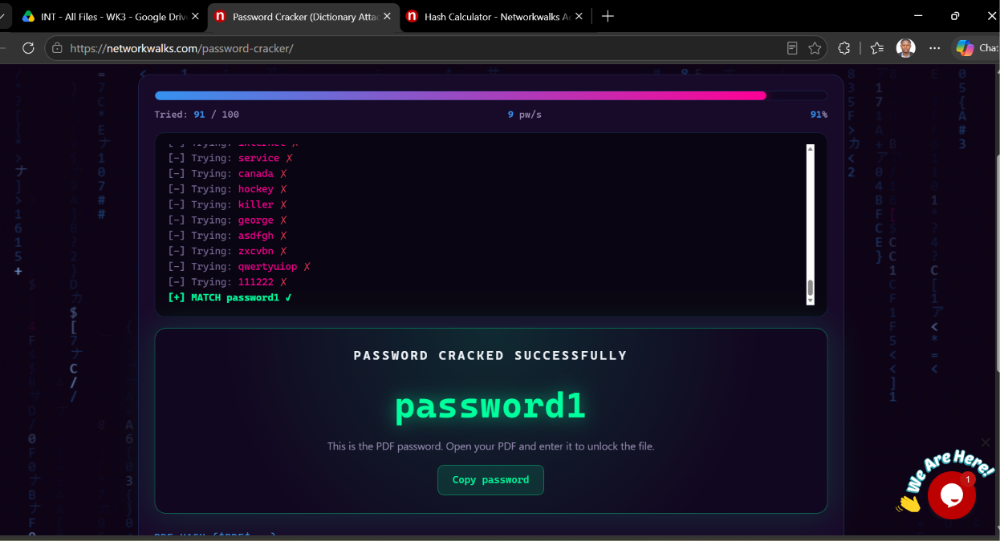
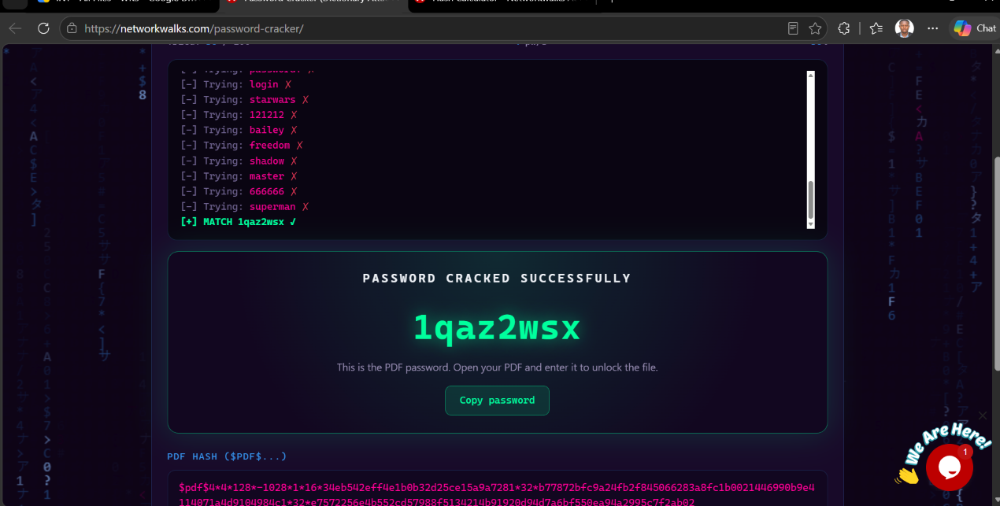
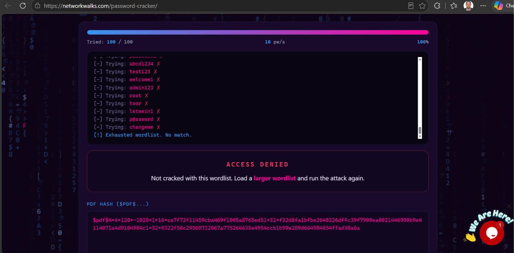
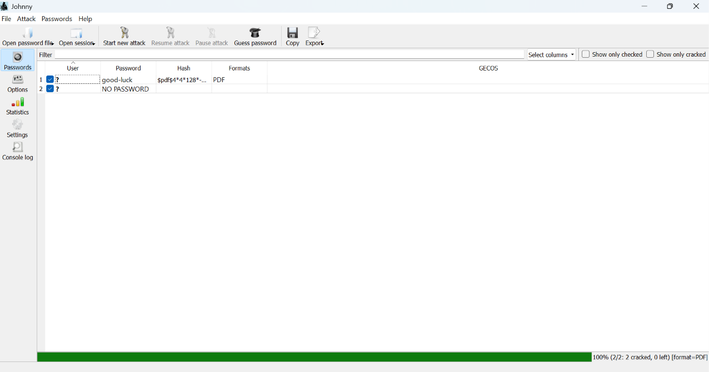

# Password Cracking Report- Hash Extraction & Dictionary Attacks

**WK3-PM1 & PM2 | Cybersecurity | Networkwalks**

| | |
|---|---|
| **Pentester Name (Cybersecurity Professional)** | Akintayo Akinjolie |
| **Program/Batch** | B083-Networkwalks |
| **Date** | 23 September 2026 |
| **Modules completed** | WK3-PM1 (Password Cracking Fundamentals & Hash Extraction), WK3-PM2 (Dictionary Attacks with John the Ripper) |
| **Client/Target** | Practice PDF files provided on the Networkwalks platform (e.g. "My Locked PDF1.pdf"), on my own local machine |
| **Permission secured from client?** | Yes — practice files supplied by Networkwalks for this exercise |
| **Phases covered** | **Phase 1:** Hash Extraction   **Phase 2:** Password Cracking (Online Dictionary Tool + John the Ripper) |

---

## 1. Liability Disclaimer

I have performed these activities only on practice files provided to me by Networkwalks as part of this training module, and on tools running on my own machine. All materials in this report are for education and research purposes only. Nothing here should be used to break the law or to crack passwords on files or systems I do not own or have not been given explicit permission to test. The instructor, the authors and Networkwalks are not responsible for what I or anyone else does with this knowledge. Every action I take is my own responsibility. Misuse of password-cracking techniques against real, non-consenting targets can lead to criminal charges, heavy fines, loss of employment and a permanent criminal record.

## 2. Introduction

This report covers Week 3 of my Cybersecurity internship at Networkwalks, focused on password cracking. The module walked me through two practical skills: extracting a crackable password hash from a protected PDF file, and then attempting to recover the original password using two different approaches — an online dictionary-attack tool, and the offline password-cracking tool **John the Ripper**.

The exercise was designed to show both the capabilities and the limits of a browser-based cracking tool compared to a dedicated offline cracker, and to reinforce why weak, predictable passwords are so easy to defeat in practice.

## 3. Tools Used

| Tool | Purpose |
|---|---|
| Networkwalks PDF Hash Extractor | Extract a crackable, hashcat/pdf2john-compatible hash from a password-protected PDF |
| Networkwalks Password Cracker | Browser-based dictionary attack tool used to attempt to recover the PDF password online |
| John the Ripper (via Johnny GUI) | Offline password-cracking tool used to recover the password after the online tool failed |
| Web Browser | Used to access the Networkwalks practice tools and capture completed-module flags |

---

## 4. Activities Performed

### 4.1 Completing the WK3-PM1 & WK3-PM2 Practical Modules

As I worked through the password cracking module on the Networkwalks platform, I captured a series of completion flags confirming each stage of the exercise was completed successfully.

*Figure 1: First flag captured after completing the initial stage of the WK3 password cracking module.*

*Figure 2: A second flag captured specifically tied to the John the Ripper exercise — a reminder that cracking passwords is about patience and the right wordlist.*

*Figure 3: A third flag captured for progressing through the module on the Networkwalks platform.*

### 4.2 Extracting the Password Hash from a Protected PDF

I used the Networkwalks **PDF Hash Extractor** tool to upload a password-protected practice file, `My Locked PDF1.pdf` (266.9 KB). The tool parsed the file locally in the browser and confirmed it was encrypted, extracting a crackable hash in **pdf2john/hashcat-compatible format** (Revision R4, Version V4, 128-bit key length). This hash is what actually gets fed into a password-cracking tool — not the PDF file itself.

*Figure 4: PDF Hash Extractor confirming "My Locked PDF1.pdf" is encrypted and extracting a crackable hash.*

### 4.3 Attempting to Crack the Password via the Networkwalks Online Tool

With a hash in hand, I first tried the browser-based **Networkwalks Password Cracker**, which runs a dictionary attack directly in the browser. On two earlier practice files, this tool succeeded quickly — cracking the passwords `password1` and `1qaz2wsx` after working through a common-password wordlist.

*Figure 5: Networkwalks Password Cracker successfully cracks a practice PDF's password as "password1".*

*Figure 6: Networkwalks Password Cracker successfully cracks a second practice PDF's password as "1qaz2wsx", a common keyboard-pattern password.*

When I then tried the same online tool against the hash extracted from `My Locked PDF1.pdf`, it worked through its full 100-word list and returned **Access Denied** — the password was not in its wordlist.

*Figure 7: The online Networkwalks Password Cracker exhausts its wordlist against My Locked PDF1.pdf's hash and returns Access Denied.*

### 4.4 Installing and Using John the Ripper (Johnny GUI)

Since the browser-based tool's wordlist wasn't enough, I installed **John the Ripper** successfully on my machine and used its **Johnny** graphical interface to load the same PDF hash(es) locally. Running the attack with John the Ripper's larger, more capable wordlist, it successfully cracked both hashes I had loaded — reaching **100% (2/2 cracked, 0 left)**. One password recovered was `good-luck`, and the second hash resolved to **"NO PASSWORD"**, meaning that particular file had no password protection at all once properly analysed.

*Figure 8: Johnny (John the Ripper's GUI) successfully cracks both loaded PDF hashes — 100% (2/2 cracked, 0 left).*

With the correct password recovered, I was able to open the previously locked PDF using the cracked password, confirming the attack had succeeded where the online dictionary tool had failed.

---

## 5. Risk Analysis / Impact

Based on the passwords recovered during this exercise, I identified the following observations about password security.

| # | Risk / Finding | Evidence / Observation | Potential Impact | Risk Level |
|---|---|---|---|---|
| 1 | Common dictionary word used as a password | "password1" was cracked by the online tool in under 100 attempts | Extremely fast to crack even with the weakest of tools; offers almost no real protection | 🟠 Medium |
| 2 | Predictable keyboard-pattern password | "1qaz2wsx" (a common keyboard-walk pattern) was cracked just as quickly | Keyboard patterns are included in virtually every standard cracking wordlist | 🟠 Medium |
| 3 | Online dictionary tool has a limited wordlist | The Networkwalks Password Cracker exhausted its 100-word list and failed against a stronger password | Gives a false sense of security if only a small/basic wordlist is used to test password strength | 🟡 Low |
| 4 | Stronger password still defeated by an offline tool | John the Ripper cracked the same hash the online tool couldn't, using a larger wordlist | Demonstrates that "not crackable by a basic tool" does not mean a password is actually strong | 🟠 Medium |
| 5 | A file was found with no password at all | Johnny reported "NO PASSWORD" for one of the loaded PDF hashes | A file that appears protected but has no real password gives zero confidentiality | 🟡 Low |

**Risk level key:** 🔴 Critical &nbsp;&nbsp; 🟠 Medium &nbsp;&nbsp; 🟡 Low

These findings are all based on practice files intentionally provided with weak passwords for training purposes, not real production data. The exercise nonetheless reflects genuine password-cracking behaviour: predictable, dictionary-based or pattern-based passwords are cracked in seconds to minutes, and the strength of the wordlist used directly determines whether an online or offline tool succeeds.

## 6. Recommendations

Based on the observations from this exercise, I recommend the following password security practices:

1. **Avoid dictionary words and common patterns**
   Passwords like "password1" or keyboard-walk patterns like "1qaz2wsx" should never be used — they are among the first entries tried in any cracking wordlist.

2. **Use long, random passphrases**
   A long passphrase made of unrelated words (or a randomly generated password) is far more resistant to both dictionary and brute-force attacks than a short, predictable one.

3. **Use a password manager**
   Password managers make it practical to use a unique, strong password for every file or account without needing to memorise each one.

4. **Never assume "not cracked yet" means "safe"**
   A password that resists a small, basic wordlist may still fall to a larger wordlist or a more capable offline tool — password strength should be judged by complexity and length, not by whether one tool failed to crack it.

5. **Don't rely on file-level password protection alone for sensitive data**
   Where real confidentiality matters, combine strong passwords with full-disk or container-level encryption and proper access controls, rather than relying solely on a PDF's built-in password protection.

6. **Regularly audit protected files for weak or missing passwords**
   As shown by the "NO PASSWORD" result in this exercise, files that are assumed to be protected should occasionally be checked to confirm they actually are.

7. **Perform password-strength testing only with authorization**
   Password cracking should only ever be performed against your own files/accounts or with explicit permission, as was the case with these Networkwalks-provided practice files.

## 7. Conclusion

During Week 3 of my Cybersecurity internship, I completed a practical module on password cracking, covering both hash extraction and two different cracking approaches.

I learned how to extract a crackable hash from a password-protected PDF using a hash-extraction tool, and the difference between the hash of a file and the file itself when it comes to password cracking. I then experienced firsthand the difference between a lightweight, browser-based dictionary attack tool and John the Ripper, a dedicated offline password-cracking tool: the online tool cracked two weak, common passwords quickly but was defeated by a third, stronger password, while John the Ripper — using a larger wordlist — successfully cracked that same hash after I installed it locally.

This reinforced an important lesson: cracking success depends heavily on the quality and size of the wordlist used, not just the tool itself. It also showed me how quickly genuinely weak or predictable passwords fall, which is exactly the kind of finding a real GRC or security assessment would flag as a risk in a password policy review.

Finally, all of this was performed against practice files explicitly provided by Networkwalks for this training exercise, reinforcing that password-cracking techniques like these should only ever be used with proper authorization.

---

## 👤 Author

**Akintayo Akinjolie (CyberJO)**
Aspiring GRC Analyst — Cybersecurity Professional, Networkwalks Internship B083

LinkedIn: [www.linkedin.com/in/rtn-akintayo-akinjolie-548751111](https://www.linkedin.com/in/rtn-akintayo-akinjolie-548751111)

---

## 📌 Project Information

**Program Name:** Cybersecurity program at Networkwalks | **Week:** 03 | **Repository:** GitHub
